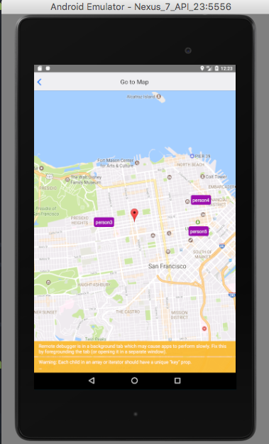
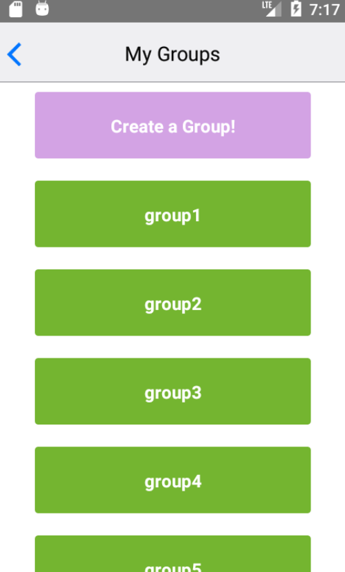

# Don't Get Lost

[DontGetLost](https://spookybit.github.io/DontGetLostDemo/)

## Background

Inspired by Find Your Friends, Don't Get Lost is an Android App that lets you keep track of your friends- no matter how directionally challenged they might be. Don’t Get Lost is a mobile app that allows users to see their location on Google Maps as well as the location of others they need to connect with.

## Functionality

With this app, users should be able to:

- [ ] Create groups
- [ ] Add group members through invites
- [ ] Access a 2D map displaying the locations of users and their group members

## Technologies and Technical Implementations
This app is built with React Native on the frontend.
The backend uses Rails with a PostgreSQL database.
It uses Google Static Maps API to update positions in real time.

## Map
The app uses Google Maps to pinpoint your location as well as the location of your friends.



```
onRegionChange(mapCoordinate) {
  this.setState({
    markCoordinate: {
      latitude: mapCoordinate.latitude,
      longitude: mapCoordinate.longitude,
      error: null
    }
  });
}
```

## Groups
Join groups to see where other group members are.



## TODOs
- [ ] Messenger feature
- [ ] Friends list
- [ ] Public groups feature
- [ ] Blocking feature
- [ ] Invisibility mode feature
